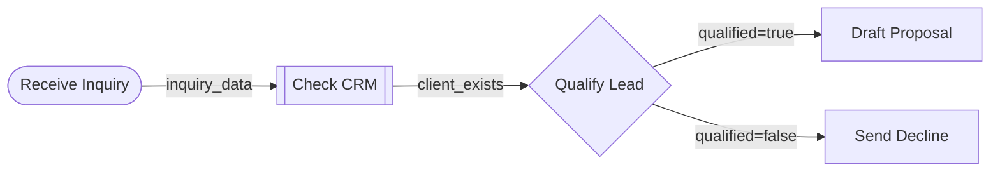

# SOP-to-DAG

Convert natural language Standard Operating Procedures into validated, machine-readable DAG (Directed Acyclic Graph) workflows.

Built on the [SOPStruct methodology](https://arxiv.org/abs/2504.00029) (JP Morgan AI Research, 2025) — the only academic approach that achieves 100% structural soundness across multiple benchmark datasets.

## What It Does

Paste any SOP — client intake, incident response, onboarding checklist, compliance procedure — and get:

1. **Mermaid diagram** — visual workflow you can paste into docs, GitHub, Notion
2. **JSON DAG** — machine-readable with the full SOPStruct node schema
3. **Validation report** — three PDDL-style structural soundness scores

## The Pipeline

```
Your SOP text
    |
    v
[1. Segment] — Break into coherent process segments
    |
    v
[2. Structure] — Decompose each segment into subtasks (7-field node schema)
    |
    v
[3. Aggregate] — Merge into one DAG with cross-segment dependencies
    |
    v
[4. Validate] — Three deterministic PDDL-style checks
    |
    v
Mermaid + JSON + Validation Report
```

## Node Schema (SOPStruct)

Every subtask has exactly these 7 fields:

| Field | Type | Description |
|-------|------|-------------|
| `name` | string | Brief action name |
| `description` | string | Detailed process description |
| `dependencies` | string[] | Subtask IDs this step depends on |
| `inputs` | string[] | Variables from initial state (NOT from dependencies) |
| `inputs_from_deps` | object | Map of which outputs come from which dependency |
| `outputs` | string[] | Variables this step produces |
| `category` | enum | Human Input, Information Processing, Information Extraction, Knowledge, Decision |

## Validation Scores

Three deterministic checks (no LLM needed — pure graph analysis):

- **Structured Plan Score** — Can the graph be traversed from start to terminal?
- **Dependency Score** — Does every node only expect data from declared dependencies?
- **Input-from-Dependency Score** — Do predecessor outputs match what successors need?

## Install

This is a [Claude Code](https://docs.anthropic.com/en/docs/claude-code) skill. Install by adding the skill folder to `~/.claude/skills/`:

```bash
# Clone and install
git clone https://github.com/deashidle-stack/sop-to-dag.git ~/.claude/skills/sop-to-dag
```

Or download the `.skill` file from [Releases](https://github.com/deashidle-stack/sop-to-dag/releases).

## Usage

In any Claude Code session, paste an SOP and ask to structure it:

```
Structure this into a workflow graph:

When a new inquiry comes in, I check our CRM for existing records.
If they exist, I pull their history. If new, I create a record.
Then I qualify the lead based on budget and project fit...
```

The skill triggers automatically on phrases like "structure this SOP", "convert to DAG", "map the dependencies", "visualize the workflow", or "make this executable".

## Example Output

### Mermaid


### Validation
```
Structured Plan Score: PASS (all nodes on valid paths)
Dependency Score: PASS (0 phantom dependencies)
Input-from-Dependency Score: PASS (all handoffs verified)
```

## Research Foundation

- **SOPStruct** (Garg et al., 2025) — Segment-Structure-Aggregate pipeline, PDDL validation
- **Flow-of-Action** — SOP-guided agents improve accuracy from 35.5% to 64.01%
- **SOP-Maze** — Top LLMs max at ~46% on complex branching SOPs

## Part of the Everform Ecosystem

This skill is the standalone SOP-to-DAG conversion engine. [Everform](https://everform.io) extends it with reliability scoring, suitability assessment, gap analysis, and a capture loop for hardening workflows.

## License

MIT
