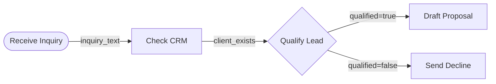

# SOP-to-DAG: Structured Process Conversion

Turn messy, natural-language procedures into clean, validated, machine-readable workflow graphs.

This skill implements the SOPStruct methodology (Garg et al., JP Morgan AI Research, 2025) — a three-phase pipeline that achieves 100% structural soundness across multiple benchmark datasets. The key insight: segmenting the SOP before structuring it prevents the information loss that kills zero-shot approaches.

## When This Skill Adds Value

SOPs written in natural language are the backbone of every organization, but they're terrible for automation. They have implicit dependencies ("obviously you check the CRM first"), ambiguous branching ("use your judgment"), and hidden knowledge ("experienced people know to call instead of email for urgent cases").

This skill converts that messy reality into a graph where every dependency is explicit, every branch has conditions, and every node declares what it needs and what it produces. The result is a workflow that an AI agent can actually follow — or that a human can audit and improve.

**What you get:**
- A **Mermaid diagram** you can paste into any markdown doc, GitHub issue, or documentation tool
- A **JSON DAG** with the full SOPStruct node schema — machine-readable, importable into workflow engines
- **Three validation scores** that tell you if the graph is structurally sound (not just "looks right")

---

## The Pipeline: Segment → Structure → Aggregate

### Phase 1: Segment

The SOP text is broken into coherent process segments. Each segment represents a logical unit of work — a cluster of related steps that form a sub-procedure.

**Why segment first?** Long SOPs (3+ pages) overwhelm LLMs when processed whole. Critical details get lost, dependencies between distant steps get missed, and the resulting graph has phantom connections. Segmentation is the single biggest quality improvement over zero-shot conversion.

**How to segment:**

1. Read the full SOP text
2. Identify natural boundaries: topic shifts, phase transitions, handoffs between actors, explicit section headers
3. Each segment should be self-contained enough to form a sub-DAG, typically 3-10 steps
4. For short SOPs (under ~500 words), a single segment is fine — skip to Phase 2

Output a numbered list of segments with brief labels. Example:
```
Segment 1: "Client intake and initial assessment" (lines 1-15)
Segment 2: "Budget qualification and routing" (lines 16-28)
Segment 3: "Proposal generation and review" (lines 29-45)
```

### Phase 2: Structure (Per Segment)

For each segment, decompose it into subtasks. Each subtask becomes a node in the DAG. Use this exact schema for every node — no exceptions, no shortcuts:

```json
{
  "subtask_id": "subtask_1",
  "name": "Brief action name",
  "description": "Detailed description of what this step does",
  "dependencies": ["subtask_id of steps this depends on"],
  "inputs": ["Variables needed that come from the initial state, NOT from dependencies"],
  "inputs_from_deps": {
    "dep_subtask_id": ["variable names received from that dependency"]
  },
  "outputs": ["Variables this step produces"],
  "category": "Human Input | Information Processing | Information Extraction | Knowledge | Decision"
}
```

**Category definitions** (use exactly these five):
- **Human Input**: Receiving and saving user-provided information
- **Information Processing**: Analyzing, verifying, or manipulating data
- **Information Extraction**: Actively searching for information not explicitly provided in the SOP
- **Knowledge**: Background information that provides context (not directly actionable)
- **Decision**: Making judgments, interpretations, or choosing between paths

**Critical rules for structuring:**

- **Dependencies are directional.** If step B needs data from step A, then `"dependencies": ["subtask_A"]` appears on step B. The edge points from A → B.
- **Inputs vs. inputs_from_deps.** `inputs` are things available at the start (user input, external data, parameters). `inputs_from_deps` maps which specific outputs come from which dependency. These MUST NOT overlap — a variable comes from either the initial state or a dependency, never both.
- **Outputs must be consumed.** Every output should appear as an input (or input_from_dep) on at least one downstream node, unless it's a terminal output of the entire procedure.
- **Be specific about conditions.** When a step branches ("if qualified, proceed to proposal; otherwise, decline"), create a Decision node with the branching condition explicit in the description, and separate downstream paths with clear dependencies.

### Phase 3: Aggregate

Merge all segment sub-DAGs into one comprehensive DAG. This is where cross-segment dependencies surface.

1. Collect all subtasks from all segments into one flat list
2. Renumber subtask IDs to be globally unique (e.g., `seg1_subtask_1`, `seg2_subtask_1`)
3. Identify cross-segment dependencies: where a later segment's input comes from an earlier segment's output
4. Add those cross-segment edges to the dependency lists
5. Verify the combined graph is acyclic (no circular dependencies)

The aggregated result is the final `structured_sop` JSON object:

```json
{
  "structured_sop": {
    "title": "Name of the procedure",
    "source_text_hash": "SHA-256 of the original SOP text (for traceability)",
    "total_subtasks": 12,
    "segments": ["Client intake", "Qualification", "Proposal"],
    "subtasks": {
      "seg1_subtask_1": { ... },
      "seg1_subtask_2": { ... },
      "seg2_subtask_1": { ... }
    }
  }
}
```

---

## Validation: Three PDDL-Style Scores

After building the DAG, run these three deterministic checks. They don't require an LLM — they're pure graph analysis. SOPStruct achieves 100% on all three across benchmark datasets. Report each as pass/fail with details.

### 1. Structured Plan Score
**Question:** Can the graph be traversed from any start node to any terminal node?

- Find start nodes (no incoming dependencies)
- Find terminal nodes (no downstream consumers of their outputs)
- BFS/DFS from each start node — verify every non-terminal node is reachable
- If any node is stranded (reachable from start but no path to a terminal), flag it

**Pass:** All nodes lie on at least one valid path from start to terminal.

### 2. Dependency Score
**Question:** Does every node only expect data from its declared dependencies?

- For each subtask, check that every entry in `inputs_from_deps` references a subtask that is in its `dependencies` list
- If a node claims to receive data from `subtask_X` but doesn't list `subtask_X` as a dependency, that's a phantom dependency

**Pass:** Every `inputs_from_deps` key exists in the corresponding `dependencies` array.

### 3. Input-from-Dependency Score
**Question:** Do dependency outputs match what successors expect?

- For each subtask, for each entry in `inputs_from_deps`, check that the referenced dependency actually declares those variables in its `outputs`
- If node B expects `"budget_range"` from node A, but node A's outputs don't include `"budget_range"`, the handoff is broken

**Pass:** Every variable in `inputs_from_deps` maps to a declared output of the referenced dependency.

---

## Output Format

Always produce both outputs in this order:

### 1. Mermaid Diagram

Generate a Mermaid flowchart using `graph LR` (left-to-right) layout. Use shapes to indicate category:

- `([text])` stadium shape for **Human Input**
- `[text]` rectangle for **Information Processing**
- `[[text]]` subroutine for **Information Extraction**
- `[(text)]` cylinder for **Knowledge**
- `{text}` rhombus for **Decision**

Label edges with the data being passed. Example:


### 2. JSON DAG

The full `structured_sop` object as defined in Phase 3 above. Write it to a file called `sop-dag.json` in the current directory.

### 3. Validation Report

A brief summary of the three scores:

```
## Validation Results
- Structured Plan Score: PASS (all 12 nodes on valid paths)
- Dependency Score: PASS (0 phantom dependencies)
- Input-from-Dependency Score: PASS (all handoffs verified)
```

If any check fails, explain exactly which nodes/edges caused the failure and suggest fixes.

---

## Handling Edge Cases

- **Very short SOPs** (under 5 steps): Skip segmentation, go directly to Phase 2
- **SOPs with loops** ("repeat until approved"): Convert to a Decision node with two paths — one continuing forward, one looping back. Note the loop in the validation report (strict DAGs don't have cycles, but bounded retry logic is common)
- **Ambiguous text**: When the SOP says things like "use your judgment" or "as appropriate", create a Decision node and note in the description that the condition is underspecified. This surfaces the ambiguity rather than hiding it
- **Missing information**: If the SOP references steps or data that aren't defined ("send it to the team" — which team?), create the node with what's available and flag the gap in the description
- **Multiple SOPs**: If the user provides several SOPs, process each independently and note cross-SOP dependencies if mentioned

---

## Research Foundation

This skill is based on:
- **SOPStruct** (Garg et al., JP Morgan AI Research, 2025) — the Segment→Structure→Aggregate pipeline and PDDL evaluation framework
- **Flow-of-Action** — SOP-guided agents improve accuracy from 35.5% → 64.01%
- **SOP-Maze benchmark** — even top LLMs max at ~46% on complex branching SOPs, validating the need for structured representation

See `references/research-summary.md` for detailed citations and methodology notes.
